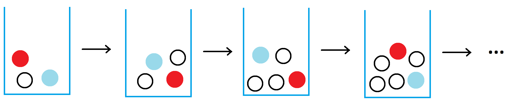
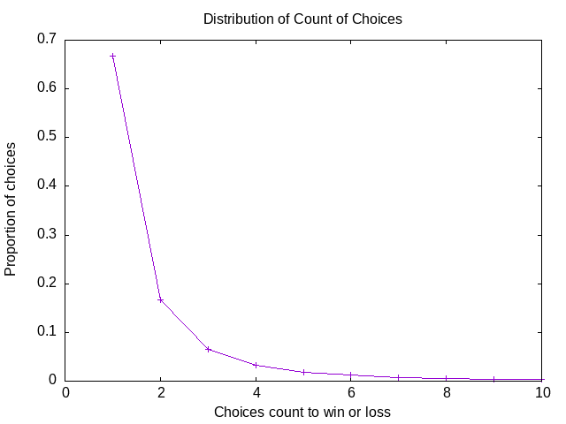

# A Game proposed on Twitter

 [Original tweet](https://twitter.com/jamestanton/status/1341736172897243136?s=03)

A bag contains 1 red, 1 blue and 1 white ball.
Pull out a ball at random.
If blue, win.
If red, lose.
Nothing for white.
Put ball back, add another white ball to bag, try again.

What are the chances of winning?
What's the hard way to answer this?



## Program

I wrote a [program](g1.go) to simulate the game
pseudo-randomly.
I think this is the hard way of answering the question.

```sh
$ go build g1.go
$ ./g1 50000
  ...
862     1
886     1
# 249930 wins, 250070 losses
# 0.4999 wins, 0.5001 losses
# Total 500000
$
```

It gives 50/50 win/loss ratio for large numbers of trials.

## Analysis

Since you get a do-over when picking a white ball,
and there's only 1 way to win, and 1 to lose,
this game has 50% chance of winning, 50% chance of losing.
Only the number of random ball-choosing is in doubt.


|Count|Number of trials|Proportion of trials|
|----:|------:|-------:|
|1|333340|0.66668|
|2|83717|0.16743|
|3|32844|0.06569|
|4|16649|0.03330|
|5|9480|0.01896|
|6|6044|0.01209|
|7|3939|0.00788|
|8|2777|0.00555|
|9|2005|0.00401|

This table represents 494383 (98.9%) of a 500,000 trial run
of the simulation program.
One of the trials took 3339 choices to get to a win or a loss.
Even this makes sense given that a white ball gets added to the
bag after every choice of a white ball: the probability of winning
or losing goes down with every non-win-or-loss choice of a white ball.

This is a very typical distribution of the count of choices
it takes to get to a win or a loss.
Just as a double check,
there are 3 balls, only one of which isn't a win or a loss,
so the 0.667 proportion of trials for 1 choice makes sense.
There are only 33% of the choices left to distribute
after that, and on the second choice, you've got a 50% chance
of winning or losing: 0.33 * 0.50 = 0.165, almost exactly
the proportion of 2-choice games.


